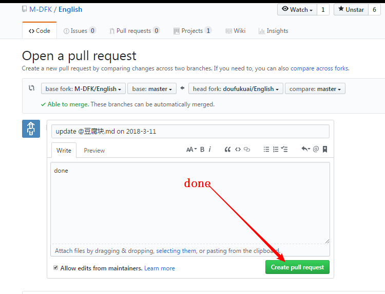

## Error1

没有在自己GitHub账户上填写内容的步骤.

以doufukuai(代表你的账户)为例.

1. 打开 豆腐块.md开始写作业

   ```python
   #同步数据
   git fetch upstream
   git merge upstream/master
   #打开自己的文件开始写作业,或者打开别人的文件开始修改.
    start @豆腐块.md
   ```

   写作作业后保存

2. 到git bash中操作.

   ```python
   git add @豆腐块.md
   git commit -m '@豆腐块 2018-3-11'
   git push origin master
   # push to your origin (branch) on website from your master (branch) on computer 

   ```

3. 到你的Github账户中去操作.

   

   

   

   


推荐一款提高效率的工具,多次黏贴复制,xclip,

https://jingyan.baidu.com/article/8cdccae9636642315413cd9f.html

##  连续多次复制黏贴的工具

Xclip

