## 准备工作

建议打开typora的大纲视图模式.

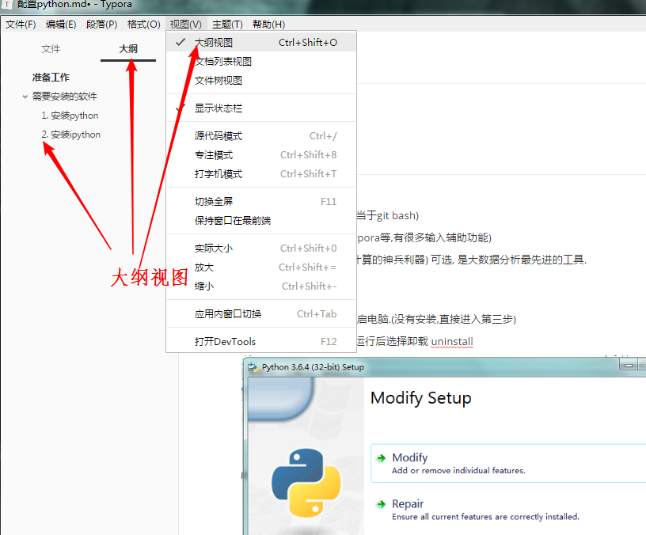

## 需要安装的软件

1. Python 官方安装文件.
2. IPython (Python交互窗口,相当于git bash)
3. vscode (编辑器,相当于word,typora等,有很多输入辅助功能)
4. Anaconda (数据分析和科学计算的神兵利器) 可选, 是大数据分析最先进的工具.


### 1. 安装python

1. 如果已经安装, 需要先卸载,重启电脑.(没有安装,直接进入第三步)

   打开下载的python安装程序,运行后选择卸载 uninstall

   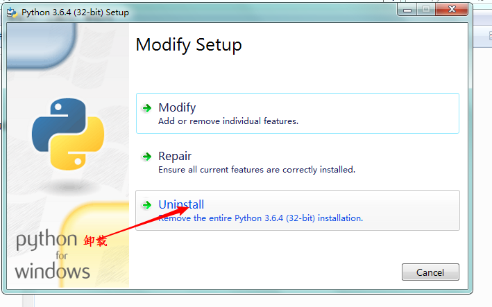

   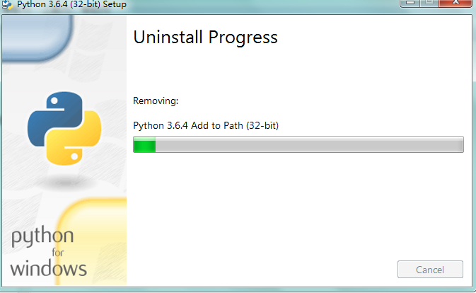

   ​

2. 卸载后重启电脑.

3. 开始安装 (如果电脑上之前没有安装,直接操作这一步)

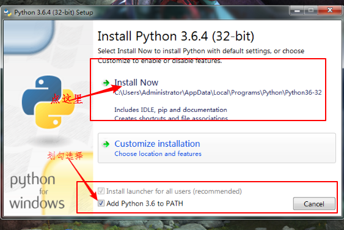

4. 等待安装完成后,打开 git bash,

   输入命令 

   `python -i' 进去玩一会.  i 是interactive的首字母,代表交互模式.

   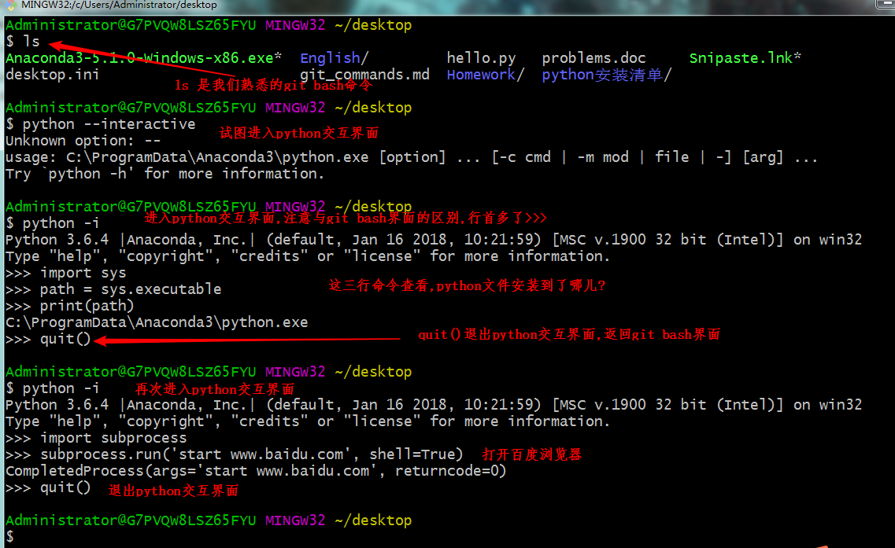


### 2. 安装ipython

ipython是一个优化的python交互界面.

体验一下自动化安装的乐趣.

继续输入命令

```python
pip install ipython
#然后,系统会自动下载和安装
# pip 是python installs packages的缩写.
```

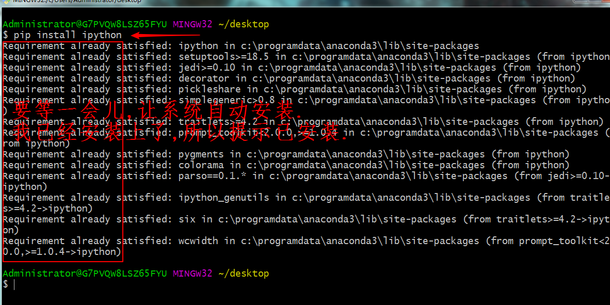


安装完成后,在进去玩一会,
输入命令:

```python
ipython -i
#注意这里跟iphone一样,在python前面多了一个i,
#从现在开始可以忘记python -i 这个命令,全部用ipython -i 取代.
```

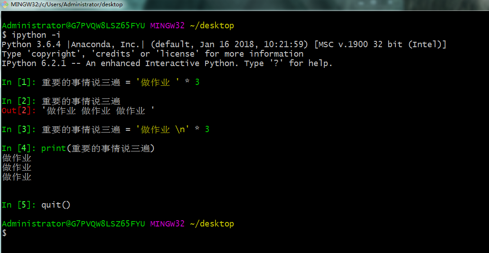


> 嵌入到git bash的python交互界面,是python shell的其中一种,也是最高效的方式,还有很多方式可以进入python交互界面,(python shell或者叫IDLE)
>
> 1) 比如,python自带的交互界面.
>
> 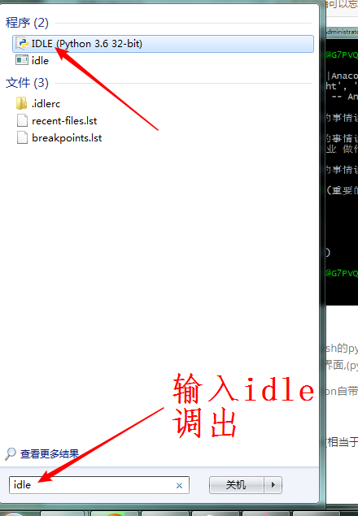
>
> 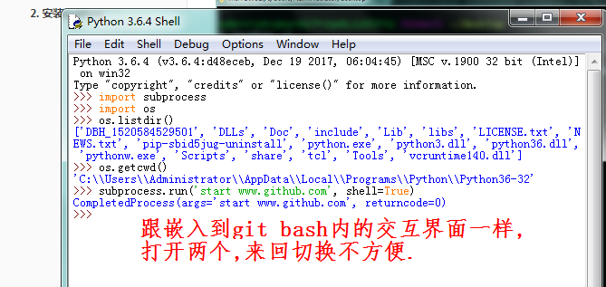
>
> 如果使用python自带的交互界面,需要在git bash和python shell之间不断地切换,很不方便.
>
> 
>
> 2) 还有一个更加不方便的是在windows,dos命令行内的交互python界面.\
>
> 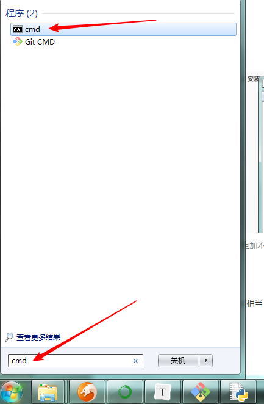
>
> 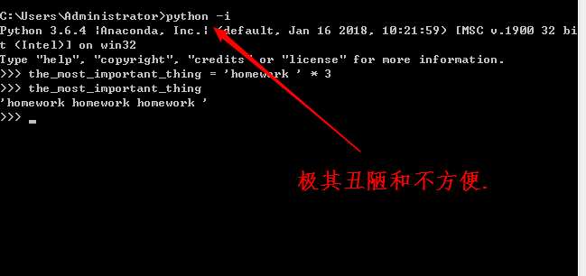


总结, 在git bash中用`ipython -i`, 运行python shell交互界面, 是比较好的选择.

另外ipython有很多魔术功能,可以到英文主页上探索探索.

### 3. 安装vscode

vscode, 相当于typora,Word,text等,只是写代码更方便和高效.

1. 将文件安装到D盘,节省C盘的空间.

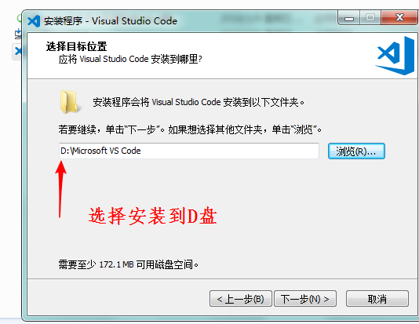

2. 其他选项全部勾选,

   ​

   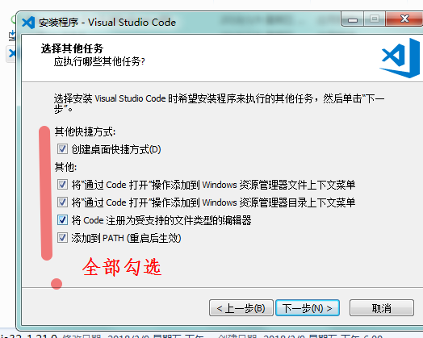

3. 杀毒报错的处理

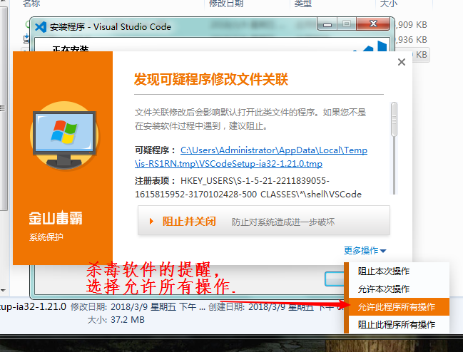


4. 安装完成,进去玩一会, 进入git bash界面,用vscode打开English文件夹下的所有文件.

   ```python
   cd ~desktop/english #切到english文件夹下.
   code .
   ```

   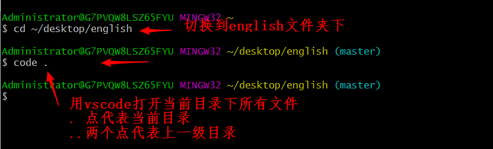

5. 打开后

   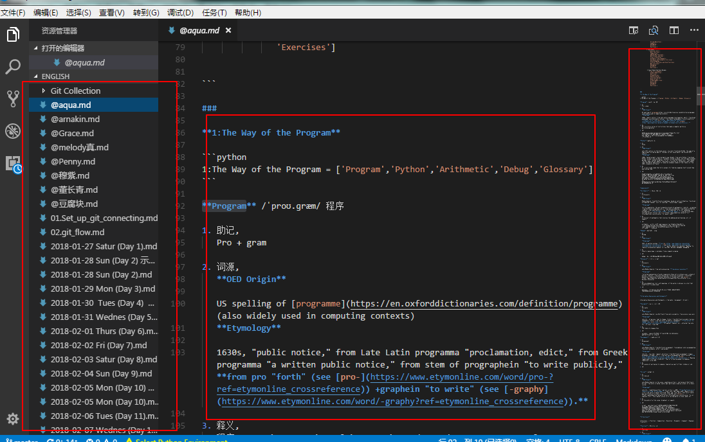

6. 高效的搜索功能.(文件夹内搜索和文件内搜索)

   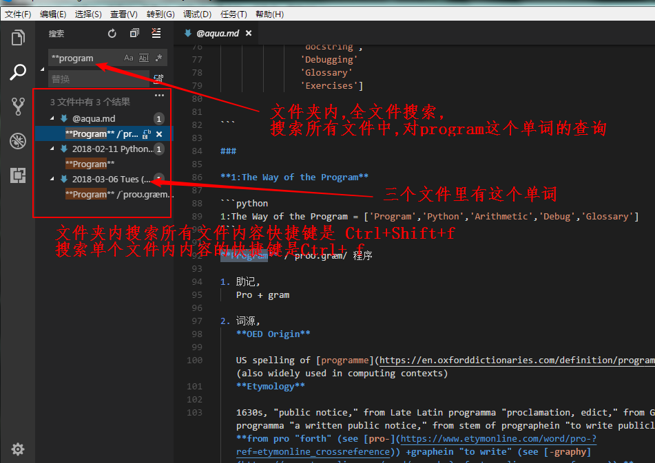

7. 当然最关键的功能是写代码.


### 4. 安装Anaconda

这是可选项,可能一两个月内用不到,

谁知道呢? 只有装上才能想起来用.

从穆紫学的单词, tool is implement.

1. 选择安装到D盘,节省C盘空间.

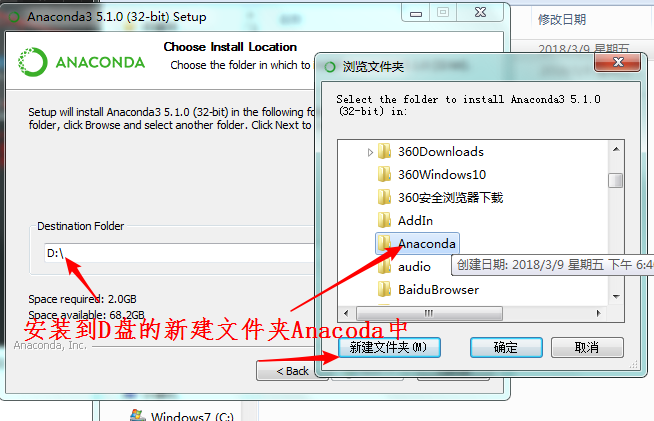


2. 高级选项,都勾选

   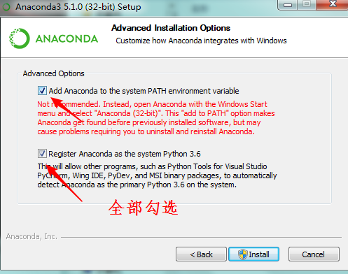

3. 最后跳过vscode的安装(已经安装过了)

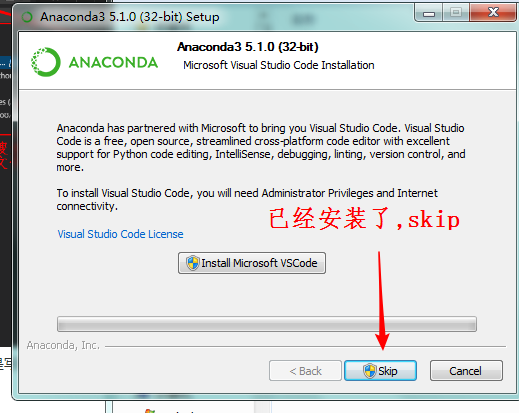


### 5. python的应用实例

实例中不涉及第四个软件Anaconda.